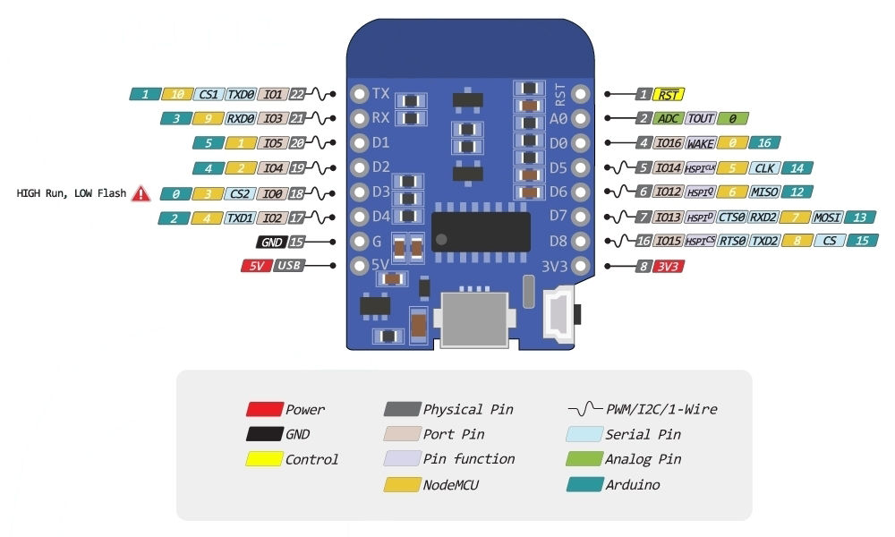

# Coffee temperature monitor
**The idea:**

Monitor the temperature of coffee with WeMos D1 mini microcontroller and MLX90614 infrared temperature sensor. Uses HC-SR04 ultrasonic sensor to detect if the coffee pot is in place or not.

Note: The HC-SR04 needs a logic level converter to work with WeMos D1 mini as the HC-SR04 is a 5V device and WeMos D1 mini GPIO ports are 3.3V

**The implementation:**

Uses Firebase Real-time database to store measurements and Firebase Functions to provide an API to query the measurements.

The API is used by a Slack slash command.

